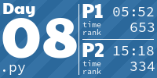

# Advent of Code 2023 Retrospective

A reflection on my experience with Advent of Code 2023 as a first-time participant. It offers my assessment of AoC as a DSA competition, as a community, and as a learning experience.

Competitively, I placed 51st on the global leaderboard with 1'065 points and 20 appearances. My best finishes were 2nd place on day 22 and 3rd place on day 7. I'm eyeing better numbers next year.

## As a DSA competition: 3/10

- Puzzle statements are way too long and vague. This is not because they include a paragraph or two about elves. You can keep the elves and still make puzzle descriptions much cleaner. Many CodeForces problems contain both a cute legend and a formal statement.
- Many puzzles require you to make additional assumptions about the input that are not guaranteed in the statement. Sometimes a solution without such assumptions exists but is not competitive, and sometimes it doesn't exist at all. This is by far the worst thing about AoC as a DSA competition.
- The scope is too broad and is not constrained to DSA. The puzzles can use anything vaguely related to technology in general. It makes AoC unique, but it's not a good thing for a DSA competition.
- AI can solve some of the puzzles from start to finish because they are too easy.
- Overall, Advent of Code is a poor DSA competition. It is designed to be this way, so nothing is going to change next year. If you want to participate in a DSA competition, AoC is not worth your time. Participate in AoC competitively ***only*** if you are ready for a chaotic, anything-goes puzzle-solving competition.

## As a community: 9/10

- The official subreddit has user-provided solutions, cool visualizations, and memes. It is a good place to learn and have a laugh. The community is friendly. However, it is also somewhat narrow-minded when it comes to novel technologies like LLMs.
- There are many unofficial Advent of Code content creators, including Twitch streamers and YouTubers. It's a fun way to hang out while solving puzzles. You can also learn this way too if you are a visual learner.
- Overall, you should ***definitely*** participate in some community events.

## As a learning experience: 7/10

- Conventional DSAs applicable in other competitions are relatively simple and do not exceed the scope of something like CodeForces Division 2. You will not learn much if you are already comfortable with this level. That said, ***most participants aren't***.
- Competitive solutions to some puzzles leverage external libraries like sympy or networkx. It is good that puzzles provide ***exposure*** to technologies you may be using at work soon.
- Overall, you can learn a lot from Advent of Code if you set your goals properly.

<!-- AOC TILES BEGIN -->
<h1 align="center">
  2023 - 50 ⭐
</h1>

<!-- AOC TILES END -->
